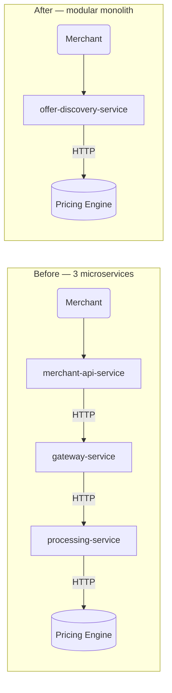

When a customer taps "Buy on EMI" at a merchant's checkout, our system has under 200ms to figure out which banks offer EMI on their card, calculate tenures and interest rates, apply merchant-specific subventions, and return a ranked list of options. This is called **EMI offer discovery** — and at Pine Labs, it runs on every checkout page load for every EMI-eligible transaction.

This is the story of how we went from a slow, fragile three-service chain to a 2000+ TPS system — not by adding hardware, but by finding and fixing a series of bugs hiding in plain sight.

---

## The original architecture

The system was split across three Kotlin/Ktor microservices chained in sequence:

```
Merchant → merchant-api-service
              ↓ HTTP
           gateway-service
              ↓ HTTP
           processing-service
              ↓ HTTP
           Pricing Engine (source of truth)
```

Each service had a clear role: `merchant-api-service` handled JWE decryption and response caching, `gateway-service` did orchestration and BIN/PAR resolution, `processing-service` called Pricing Engine and managed issuer/brand caches.

On paper, clean. In practice, every request paid the cost of **8 serialization/deserialization cycles** — in and out of each service boundary using Gson's reflection-based serializer — and **2 internal HTTP round trips** that added network overhead with zero customer benefit. The three services were always deployed together, scaled together, and failed together. Classic distributed monolith.




---

## Bug #1: A thread pool set to 8× the wrong value

The first performance issue was invisible in code review:

```kotlin
// Application.kt
install(Netty) {
    callGroupSize = 32   // ← this line cost 6x latency
}
```

On a **2-vCPU pod**, 32 coroutine executor threads caused extreme OS-level context switching. With 32 threads competing for 2 cores, the scheduler spent more time context-switching than executing. Under load testing with JMeter at 8 virtual users, we observed **350ms average latency** — around 6× higher than Pricing Engine's own response time would justify.

The fix was one line:

```kotlin
callGroupSize = Runtime.getRuntime().availableProcessors() * 2
```

On a 2-vCPU pod: 4 threads. Result: **350ms → 54ms**. Six times faster. Same infrastructure, no logic changed — just thread count.

**Rule established:** Never hardcode thread pool sizes. Always derive from `availableProcessors()`.

---

## Bug #2: Spans lied about 273ms of work

After fixing the thread count, OpenTelemetry traces showed Pricing Engine HTTP calls at **27ms**. But end-to-end latency was still **300ms**. The gap was completely invisible in traces.

```
Pricing Engine network time (traced span): 27ms  ← what engineers saw
Body read + JSON deserialization:         +273ms  ← invisible
─────────────────────────────────────────────────
Total experienced by merchant:            300ms
```

The span closed when HTTP **response headers** arrived. But the response body (~70KB of Pricing Engine JSON) was read and deserialized *after* the span closed:

```kotlin
// Old pattern — allocates full String, then parses
val body = response.bodyAsText()
val result = snakeCaseJson.decodeFromString<T>(body)
```

Under load with `Dispatchers.IO` unbounded, 200+ concurrent requests each spawned a new thread to deserialize. Thread count jumped from 240 to 450 under load, each thread queueing behind others.

Two fixes:

```kotlin
// Fix 1: stream directly from byte channel, no intermediate String
val result = response.body<T>()

// Fix 2: cap thread spawn under load
dispatcher = Dispatchers.IO.limitedParallelism(50)
```

Thread count stabilised at ~290 under sustained load. Deserialization latency dropped ~20ms.

---

## The modular monolith

After diagnosing both bugs, the question became: keep fixing the chain, or reconsider the architecture?

The three services shared no independent lifecycle. They were always deployed together, always scaled together. The microservice split existed on a diagram but not in operational practice.

We built `offer-discovery-service` — a **modular monolith** that collapses all three into one Kotlin/Ktor process:

| Dimension | Three services | Modular monolith |
|---|---|---|
| Internal HTTP hops | 2 | 0 |
| Serialization cycles per request | 8 | 2 |
| Redis clients | 3 (one per service) | 1 (Lettuce async) |
| Memory per instance | ~3 × 600MB JVM | ~600MB JVM |

The 15-step discovery flow — JWE decrypt, BIN/PAR resolution, cache check, Pricing Engine call, issuer/brand enrichment, response caching, merchant customisation — now happens in a single process using direct function calls.

We kept the same merchant-facing API contract and Redis cache keys for a zero-downtime cutover.

---

## Serialization: Gson → Kotlinx

Alongside the architectural change, we migrated all serialization from Gson to **kotlinx.serialization**. Gson's reflection-based approach had four compounding problems:

- Field name mismatches fail **silently at runtime**, not at compile time
- Gson assigns `null` into non-nullable Kotlin fields without warning
- `Float`/`Double` inconsistency: Gson strips trailing zeros (`16.0` → `"16"`), Kotlinx preserves them
- Incompatible with GraalVM native image (reflection requires per-class config)

The migration touched 222+ `@Serializable` model classes across 4 repositories. The most impactful change was collapsing `snakeCaseJson` and `camelCaseJson` — separate `Json` instances that caused a latent bug in the convenience fee HTTP client — into a **single `appJson` instance** used everywhere.

---

## GC tuning: the ZGC experiment that lost

With a stable baseline (54ms avg, 72 req/s, single pod, cache disabled), we ran GC experiments. ZGC promised near-zero pause times and better P99. Here's what happened on our **2-vCPU / 4GB pods**:

| Metric | G1GC | ZGC |
|---|---|---|
| Heap usage | 10.7% | 61% |
| CPU utilisation | 58–73% | 62–90% |
| P90 latency | 65ms | **84ms** |
| P99 latency | 114ms | **148ms** |
| Outliers ≥500ms | ~0 | 13 |

ZGC was strictly worse across every metric. ZGC's concurrent GC threads compete directly with application threads on 2-vCPU pods. It is designed for **8GB+ heaps and 4+ cores** — on constrained cloud pods, it takes CPU away from the application while collecting garbage.

Final G1GC config that worked:
```
-XX:+UseG1GC
-XX:MaxGCPauseMillis=100
-XX:InitiatingHeapOccupancyPercent=35
-XX:+UseStringDeduplication
-XX:MaxRAMPercentage=75
```

`IHOP=35` — triggering mixed GC at 35% old gen instead of the default 45% — was the most impactful knob. It prevents Old Gen from filling up and forcing expensive Full GCs.

---

## Cache arithmetic: where 2000+ TPS comes from

The system has two operating modes:

**Cache miss (every request hits Pricing Engine):**
- ~45ms for Pricing Engine HTTP call
- ~9ms compute (mapper + serialization)
- **54ms end-to-end, ~72 req/s per pod**

**Cache hit (Redis discovery response, GZIP compressed):**
- ~2ms for Redis read + GZIP decompress
- **~400 req/s per pod**

In production, the vast majority of requests are cache hits. The discovery response is stored as GZIP-compressed JSON (~70KB uncompressed → ~1-3KB compressed, TTL 300s). With 5+ pods under HPA, the ceiling is **2000+ TPS** — scaling linearly as more pods come up.

The cache key is an SHA-256 hash of the request fields. Cache is bypassed for velocity-limited requests and when a debug feature toggle is active.

---

## The Kong gateway ceiling

During load testing with 100 JMeter threads, we hit a wall at **~450 TPS** with 220ms average response time — despite service logs showing 53ms. That's 167ms unaccounted for.

It wasn't the application. **Little's Law** explained it exactly:

```
TPS = concurrent_threads / avg_latency
    = 100 / 0.220s
    = 454.5 TPS
```

The 167ms overhead lived entirely between JMeter and the application: Kong API Gateway TLS, routing, and network transit. Without observability at the service boundary (we used Last9 to correlate Kong-side and service-side latency), this would have been misdiagnosed as an application bottleneck.

---

## What we explored: Go and GraalVM

Two parallel tracks ran alongside the production work:

**Go rewrite** (`offer-discovery-service-go`): under 1 s startup (vs 15-20 s JVM), 50–300 MB RSS (vs 800–1200 MB). Average latency was identical — Pricing Engine at ~45ms is the bottleneck regardless of language. The real win: P99 consistency (no GC stop-the-world) and 5× better pod density on nodes.

**GraalVM native image**: 50-200ms startup, 150-250MB RSS. The challenge was that the OTEL Java Agent uses bytecode instrumentation incompatible with AOT compilation. We built a custom observability stack using direct OpenTelemetry SDK API calls with structured JSON logging — fully GraalVM compatible. Memory at 4-5× fewer resources per pod.

Neither ships in the first production release. JVM branch first; native image and Go are validated in parallel.

---

## Numbers

| Metric | Before | After |
|---|---|---|
| Average latency (cache off) | 350ms | **54ms** (6×) |
| Throughput (cache off, 1 pod) | ~12 req/s | **72 req/s** (6×) |
| Throughput (cache on, production) | ~40 req/s | **~400 req/s per pod** |
| Internal HTTP hops | 2 | 0 |
| Serialization cycles | 8 | 2 |
| Thread count under load | 450 (unbounded) | ~290 (bounded) |
| GC overhead at steady state | — | 0.33% |
| P99 latency | 200ms+ | 83ms |

---

## What I'd do differently

**Observability first.** The callGroupSize bug and the 273ms deserialization gap both hid for weeks because we didn't have span coverage inside the body-read phase. Custom spans around every network call — including body deserialization — would have surfaced both immediately.

**Question service boundaries early.** The three-service split was inherited. If someone had asked "do these services ever deploy or scale independently?" the answer was no — and the monolith would have been the starting design, not the sixth-month refactor.

**Run the ZGC experiment anyway.** Even though ZGC lost decisively, running it on production-equivalent pods with a real workload gave us concrete data. "ZGC is better for P99" is true in the abstract. "ZGC is 34ms worse at P99 on 2-vCPU pods" is what actually matters.
